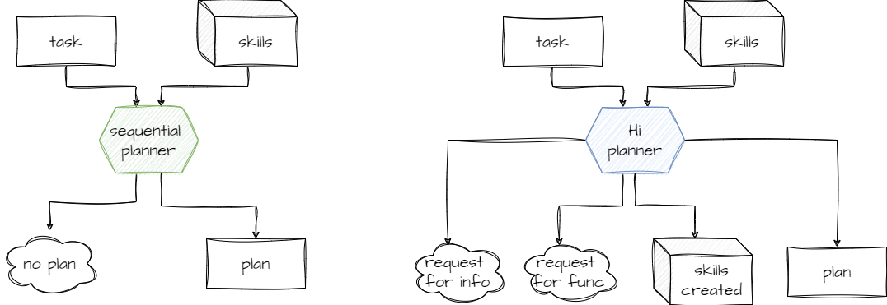

> Code will be available soon or is on-demand now, cause it's under heavy cleanup and refactoring. 

TODO:
- add task split loop example
- ...
- ...


# Intro
Hi planner is hierarchical or high-level planner.
Goal of this work is to propose alternative to commonly used sequential planners (LangChain, SemanticKernel etc.). 
We are looking only at plan generation phase, not plan execution phase.



Both sequential and hi planners have same input : task description and skillset.
__Sequential planner__ can either produce plan or error, while __hi planner__ can create simple functions or call for help requireing more info or functions if it can not create plan.

# Example

Given the objective: "Summarize an input, translate it to French, and e-mail it to John Doe", the following plan was devised:
And functions
  - SummarizePlugin.Summarize
  - WriterPlugin.Translate
  - email.GetEmailAddress
  - email.SendEmail
Both __sequential__ and __hi__ planners produce same result

```
Steps:
  - SummarizePlugin.Summarize input='$INPUT' => SUMMARY
  - WriterPlugin.Translate input='$SUMMARY' => TRANSLATED_SUMMARY
  - email.GetEmailAddress input='John Doe' => EMAIL_ADDRESS
  - email.SendEmail input='$TRANSLATED_SUMMARY' email_address='$EMAIL_ADDRESS'
```
Given same objective and no functions __sequential planner__ produces error, since no plan can be created. While __hi planner__ produces quite extensive response

```
functions created:
    - Summarize
    - Translate
    - SendEmaiL
information request:
    - John Doe's email
```

# Algorithm

Plan creation is split into several areas
- Sequential planner - conventional planner
- Skills creation (python, LLM, or others)
- Task split into smaller tasks
- Decision block that chooses what to try next (create new skill, split task, request for info/functionality)

## Skill creation
For now simple code or prompt generation is used - it can definetly be extended.

## Task split
Step is very similar to creating sequential step, except we are to generate functions descriptions required to generate plan.


[Full version](/docs/task_split_example_1.md)

```
task: Summarize, translate and email text
inputs:
    - name: input_text
        value: "This is a sample text that needs to be summarized, translated and emailed."
functions: 
    - name: summarize_text
        description: This function takes a text as input and returns a summarized version of it. It uses a text summarization algorithm to achieve this.
        verification: Check if the output text is a shorter version of the input text and retains the main points.
        parameters:
            - name: text
            description: The text to be summarized
        outputs:
            - description: The summarized text
    ...

steps:
    - name: Summarize the text
    ...
    - name: Translate the text
    ...
    - name: Email the text
```

For further processing we ignore steps and try to implement functions.


## Decision block
Here main decision is made given task, skillset and step already taken at this level (i.e. we already might tried to implement function using python but did not succeed).
Options are
- try to create new skill using different skill creation approaches - python code generation, prompt for LLM, shell scrit etc.
- try to split task into smaller tasks
- call for help either with lack information or lack of skills in skillset (including the one we moight have generate)


Tricks here 
- switch from task solving to more general function generation
- check if we are in the loop, i.e. planner splits tasks into smaller tasks, but smaller task are almost equal to original task (check [task split loop](/docs/task_split_loop.md) for details)
- !__main__ trick is to use LLM as expert, not trying to hard code rules


# Consluion and future work
This work started as part of bigger initiative to create [__workforce agent__](https://skaska.pro/workforce-agent). More __interactive__ and __capable__ planner is crucial part of that initiative.

### Add domain knowledge
Having decision block implemented the way it's descrbed above makes it possible to extend this block with both more tool creation options and external knowledge use. These knowledge might include information for task execution and information for task execution planning.  

### Extract prompts to separate repo
All logic is implemented using prompt engineering, thus they can extracted to separate repository. 
One of the reason for extraction is to separate development lifecirles of main code and AI prompting.


